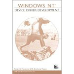

# Windows NT Driver (Legacy)

  
## Introduction
If you are newcomer in WinNT driver and looking for very basic tutorials for writing Windows driver model in assembly and c/c++ language. This repository is what you want in order to learn more about WinNT driver model. All of codes are compiled and tested based on WDK 7600 and Windows XP x86 platform, enjoy !
  
### https://steward-fu.github.io/website/index.htm
